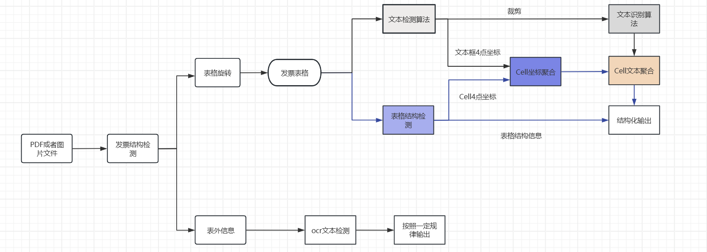

# BankTableRec
Bank statement recognition银行流水识别(基于base on yolo,TATR,paddle)

# 基于 PP-StructureV2 的发票与表格识别系统

## 项目简介

本项目基于YOLO,TATR,飞桨技术，开发了一套高效、智能的发票与表格识别解决方案，支持从图像或PDF文档中精准检测并提取发票与表格信息，适用于税务数据录入、数据归档、数据库构建等场景。

## 功能特点

- ✅ **自动解析表格结构**  
  能自动识别复杂表格结构（如合并单元格、多级表头），准确提取数据，大幅提高处理效率。

- ✅ **支持复杂表格处理**  
  对于嵌套表格、不规则分列等复杂布局，系统可智能解读并分类关键信息，满足多样化需求。

- ✅ **灵活适应多种格式**  
  无论表格发票设计风格如何变化，系统都可灵活应对，保证识别性能一致性与稳定性。

## 技术流程

1. **输入图像预处理**  
   - 发票与表格区域检测  
   - 图像旋转角度计算与裁切

2. **结构化处理**  
   - 调用视觉模型对表格结构规范化  
   - 内容分区划分

3. **内容提取与OCR识别**  
   - 基于结构化结果推理文字区域坐标  
   - OCR模型提取可复制粘贴文字内容

4. **结果导出**  
   - 支持导出格式：`json`, `csv`, `pdf`, `excel`, `txt`, `word`, `html` 等  
   - 可视化展示提取结果

## 应用场景

- 📄 税务发票录入  
- ☁️ 数据上传至税务系统  
- 🗂 数据留档  
- 🏗 构建发票/表格数据库  

## 输入样例

支持以下输入格式：

- 📷 扫描件
- 📄 PDF文档
- 📱 手机拍照图像

## 输出样例

- 结构化图表
- 可编辑文本内容
- 指定格式的 `JSON` 文件

## 技术路线

##训练模型下载地址：

## 技术支持

本项目文本识别基于 [PaddleOCR](https://github.com/PaddlePaddle/PaddleOCR) 实现，推荐使用 PP-StructureV2 模型以获得最佳识别效果。

欢迎贡献与反馈！
